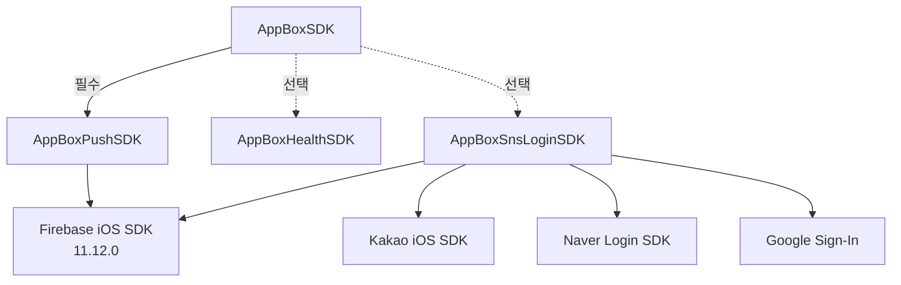

# AppBox SDK (iOS)

[](https://swift.org/package-manager/)
[](https://github.com/MobilePartnersCo/AppBoxSampleiOS)

- AppBox SDK는 모바일 웹사이트를 앱으로 패키징하여 최소한의 개발로 App Store에 등록할 수 있는 솔루션입니다.
- 모바일 웹사이트에서 JavaScript 코드를 사용해 앱의 기능을 사용할 수 있으며, 약 40+ 기능을 무료로 제공합니다.
- SDK 형태로 제공되며, 도메인(또는 Base URL)만 입력하면 기본 브라우저 기능부터 간편히 사용 가능합니다.

---

## AppBox SDK 사용 샘플소스

- iOS 샘플 앱: https://github.com/MobilePartnersCo/AppBoxSampleiOS

---

## 라이선스

- AppBox SDK의 사용은 영구적으로 무료입니다. 기업 또는 개인 상업적인 목적으로 사용 할 수 있습니다.

---

## 개발자 메뉴얼

- 메뉴얼: https://www.appboxapp.com/guide/appbox/%EC%B4%88%EA%B8%B0%20%EC%84%A4%EC%A0%95

---

## 데모앱 다운로드

- GooglePlay: https://play.google.com/store/apps/details?id=kr.co.mobpa.appbox
- AppStore: https://apps.apple.com/kr/app/id6737824370

---

## 최신 업데이트 (v1.0.44, 2025.12.12)

- `AppBoxSnsLoginSDK` 지원 추가 (네이버/카카오/구글/애플 로그인)
- 브릿지 액션 추가
  - `application.snsLogin`
  - `application.snsLogout`

---

## SDK 구성(모듈)

| 모듈 | 필수 여부 | 설명 |
|---|---:|---|
| `AppBoxSDK` | ✅ | 핵심(WebView/브릿지/공통 UI/스토리지/시스템 기능/인앱 메시지) |
| `AppBoxPushSDK` | ✅ | 푸시/FCM 연동(필수) |
| `AppBoxHealthSDK` | 선택 | HealthKit(걸음 수 등) |
| `AppBoxSnsLoginSDK` | 선택 | SNS 로그인(네이버/카카오/구글/애플) |

<details>
<summary>의존성 다이어그램(mermaid)</summary>



</details>

---

## 전체 기능 (요약)

- 브라우저의 기본기능
- 생체 인증, 탭 메뉴/브라우저 메뉴/햄버거 메뉴, 진동, 로딩 아이콘, 토스트 메시지, 인트로
- 플로팅 메뉴, 로컬 푸시, 앱 평가, 달력, 팝업(전체/중앙/바텀시트), 이미지 뷰어, 외부 페이지 열기
- 바코드/QR 스캐너, QR/바코드 팝업, 업데이트 실행, 다른 앱 실행
- 공유하기, 앱 종료, 위치 조회, 전화걸기, 문자보내기, 걸음수(HealthKit), 푸시 토큰, 세그먼트 전송 등
- SNS 로그인(선택): 네이버/카카오/구글/애플 (`application.snsLogin`, `application.snsLogout`)

---

## 브라우저의 기본기능

- 동영상 플레이어의 전체화면 지원
- KG이니시스, 토스페이먼트, 나이스페이먼츠 등의 PG결제 지원
- 파일 업/다운로드: WebView 내에서 파일 업로드 및 다운로드 지원
- `window.open()`으로 새창 열기 지원

---

## 설치 방법 (SPM)

AppBoxSDK는 Swift Package Manager를 통해 배포됩니다.  
`AppBoxPushSDK`는 Firebase(`firebase-ios-sdk`) `11.12.0`에 종속됩니다.

1. Xcode에서 `Project Target` → `Package Dependencies` → `+` 를 눌러 패키지 추가 화면을 엽니다.
   

2. 다음 SPM URL을 추가합니다.
   ```console
   https://github.com/MobilePartnersCo/AppBoxSDKFramwork
   ```

3. Dependency Rule을 설정하고 Add Package를 눌러 추가합니다.
   

4. 필요한 모듈을 선택하여 타겟에 추가합니다.
   

5. 설정 완료
   
   

---

## 설정

### Info.plist (AppBoxSDK)

```xml
<key>NSFaceIDUsageDescription</key>
<string>생체인증을 사용하기 위해 필요합니다.</string>
<key>NSCameraUsageDescription</key>
<string>카메라를 사용하기 위해 필요합니다.</string>
<key>NSLocationWhenInUseUsageDescription</key>
<string>위치정보 제공을 위해 필요합니다.</string>
<key>NSAppTransportSecurity</key>
<dict>
    <key>NSAllowsArbitraryLoads</key>
    <true/>
</dict>
```

다른 앱 열기 기능을 사용하려면 다음도 추가합니다.

```xml
<key>LSApplicationQueriesSchemes</key>
<array>
   <string>{호출할 앱 스키마}</string>
</array>
```

### Info.plist (AppBoxHealthSDK)

```xml
<key>NSHealthShareUsageDescription</key>
<string>걸음수를 가져오기 위해 필요합니다.</string>
<key>NSHealthUpdateUsageDescription</key>
<string>걸음수를 가져오기 위해 필요합니다.</string>
```

### Info.plist (AppBoxSnsLoginSDK, 선택)

```xml
<key>CFBundleURLTypes</key>
<array>
  <!-- Google -->
  <dict>
    <key>CFBundleURLSchemes</key>
    <array>
      <string>com.googleusercontent.apps.YOUR_CLIENT_ID</string>
    </array>
  </dict>
  <!-- Naver -->
  <dict>
    <key>CFBundleURLSchemes</key>
    <array>
      <string>YOUR_NAVER_URL_SCHEME</string>
    </array>
  </dict>
  <!-- Kakao -->
  <dict>
    <key>CFBundleURLSchemes</key>
    <array>
      <string>kakaoYOUR_KAKAO_APP_KEY</string>
    </array>
  </dict>
</array>

<key>LSApplicationQueriesSchemes</key>
<array>
  <string>kakaokompassauth</string>
  <string>kakaotalk</string>
  <string>naversearchapp</string>
  <string>naversearchthirdlogin</string>
</array>
```

---

## Signing & Capabilities

### HealthKit (AppBoxHealthSDK)

걸음수를 사용하려면 `Signing & Capabilities`에 HealthKit을 추가해야합니다.

1. `Targets` → `Signing & Capabilities` → `+ Capability`
   
2. `HealthKit` 검색 후 적용
   
3. 설정 완료
   

### Push Notifications (AppBoxPushSDK)

푸시를 사용하려면 `Signing & Capabilities`에 Push Notifications을 추가해야합니다.

1. `Targets` → `Signing & Capabilities` → `+ Capability`
   
2. `Push Notifications` 검색 후 적용
   
3. 설정 완료
   

### Service Extension (푸시 이미지 사용 시, AppBoxPushSDK)

푸시에 이미지를 사용하려면 Notification Service Extension을 추가하고 `App Groups`를 설정합니다.

1. Extension 추가(예시)
   
2. `Notification Service Extension` 선택
   
3. 이름 입력 후 생성
   
4. `Don't Activate`
   
5. Extension의 Minimum Deployment를 메인 앱과 동일하게 설정
   
6. 메인 앱에 `App Groups` 추가
   
   
7. App Group 생성 및 활성화
   
   
   
8. Extension 타겟에도 동일 App Group 활성화
   
9. Extension 타겟에 `AppBoxPushSDK` 추가
   
   
   

`NotificationService.swift` 적용 예시:

```swift
import UserNotifications
import AppBoxPushSDK

class NotificationService: UNNotificationServiceExtension {

  override func didReceive(_ request: UNNotificationRequest,
                           withContentHandler contentHandler: @escaping (UNNotificationContent) -> Void) {
    AppBoxPush.shared.createFCMImage(request, withContentHandler: contentHandler)
  }
}
```

---

## 사용법

### 1) SDK 초기화

`AppDelegate`에서 초기화를 진행합니다.

```swift
import UIKit
import AppBoxSDK // 필수
import AppBoxPushSDK // 필수
import AppBoxSnsLoginSDK // SNS 로그인 사용 시
import WebKit
import UserNotifications

@main
final class AppDelegate: UIResponder, UIApplicationDelegate, UNUserNotificationCenterDelegate {
  func application(_ application: UIApplication,
                   didFinishLaunchingWithOptions launchOptions: [UIApplication.LaunchOptionsKey: Any]?) -> Bool {

    // AppBox 로컬노티 사용 또는 AppBoxPushSDK 모듈 사용 시
    UNUserNotificationCenter.current().delegate = self

    // WebConfig 설정(선택)
    let appBoxWebConfig = AppBoxWebConfig()
    let wkWebViewConfig = WKWebViewConfiguration()
    if #available(iOS 14.0, *) {
      wkWebViewConfig.defaultWebpagePreferences.allowsContentJavaScript = true
    } else {
      wkWebViewConfig.preferences.javaScriptEnabled = true
    }
    appBoxWebConfig.wKWebViewConfiguration = wkWebViewConfig

    // AppBox 초기화
    AppBox.shared.initSDK(
      baseUrl: "https://www.example.com",
      projectId: "YOUR_PROJECT_ID",
      webConfig: appBoxWebConfig,
      debugMode: true
    )

    //AppBoxSnsLogin 사용시 (사용 SNS로그인 선택후 초기화)
    AppBoxSnsLogin.shared.initializeKakao(appKey: "YOUR_KAKAO_APPKEY") // 카카오 로그인 초기화
    AppBoxSnsLogin.shared.initializeNaver(
      appName: "YOUR_NID_APPNAME",
      clientId: "YOUR_NID_CLIENTID",
      clientSecret: "YOUR_NID_CLIENTSECRET",
      urlScheme: "YOUR_NID_URLSCHEME"
    ) // 네이버 로그인 초기화
    AppBoxPush.shared.initializeFirebaseClientID(
      clientID: "YOUR_FIREBASE_CLIENTID"
    ) // 구글 로그인 초기화

    return true
  }

  func application(_ application: UIApplication, didRegisterForRemoteNotificationsWithDeviceToken deviceToken: Data) {
    // AppBoxPushSDK 모듈 사용 시
    AppBoxPush.shared.appBoxPushApnsToken(apnsToken: deviceToken)
  }

  func application(_ app: UIApplication,
                   open url: URL,
                   options: [UIApplication.OpenURLOptionsKey : Any] = [:]) -> Bool {
    if AppBox.shared.handleURL(url) { return true }
    if AppBoxSnsLogin.shared.handleURL(url) { return true }
    return false
  }

  // 알림이 클릭이 되었을 때
  func userNotificationCenter(_ center: UNUserNotificationCenter,
                              didReceive response: UNNotificationResponse,
                              withCompletionHandler completionHandler: @escaping () -> Void) {
    // -----------------------------------------------------------------------------------------
    // AppBox 푸시 이동 처리
    // -----------------------------------------------------------------------------------------
    AppBox.shared.movePush(response: response)
    // -----------------------------------------------------------------------------------------
    completionHandler()
  }

  // foreground일 때, 알림이 발생
  func userNotificationCenter(_ center: UNUserNotificationCenter,
                              willPresent notification: UNNotification,
                              withCompletionHandler completionHandler: @escaping (UNNotificationPresentationOptions) -> Void) {
    completionHandler([.badge, .alert, .sound])
  }

  func application(_ application: UIApplication,
                   didReceiveRemoteNotification userInfo: [AnyHashable : Any],
                   fetchCompletionHandler completionHandler: @escaping (UIBackgroundFetchResult) -> Void) {
    AppBox.shared.handledidReceiveRemoteNotification(userInfo: userInfo)
    completionHandler(.newData)
  }
}
```

### 2) SDK 실행

```swift
AppBox.shared.start(from: self) { isSuccess, error in
  if isSuccess {
    print("AppBox:: SDK 실행 성공")
  } else {
    print(error?.localizedDescription ?? "error : unknown Error")
  }
}
```

### 3) 추가 기능 설정

```swift
// Debug 모드 재설정
AppBox.shared.setDebug(debugMode: true)

// 당겨서 새로고침
AppBox.shared.setPullDownRefresh(used: true)
```

인트로 설정(선택):

```swift
if let introItem1 = AppBoxIntroItems(imageUrl: "https://example.com/image.jpg") {
  let intro = AppBoxIntro(
    indicatorDefColor: "#a7abab",
    indicatorSelColor: "#000000",
    fontColor: "#000000",
    item: [introItem1]
  )
  AppBox.shared.setIntro(intro)
}
```

---

## 브릿지 액션(Contract)

- AppBoxSDK Contract: `docs/AppBoxSDK/README.md`
- AppBoxPushSDK Contract: `docs/AppBoxPushSDK/README.md`
- AppBoxHealthSDK Contract: `docs/AppBoxHealthSDK/README.md`
- AppBoxSnsLoginSDK Contract: `docs/AppBoxSnsLoginSDK/README.md`

---

## 요구 사항

- iOS 13.0 이상
- Swift 5.4 이상
- Xcode 15.0 이상 권장

---

## 주의 사항

1. `initSDK`를 호출하여 SDK를 초기화한 후에만 다른 기능을 사용할 수 있습니다.
2. 초기화를 수행하지 않으면 실행 시 예외가 발생할 수 있습니다.

---

## 지원

- 이메일: contact@mobpa.co.kr
- 홈페이지: https://www.appboxapp.com
