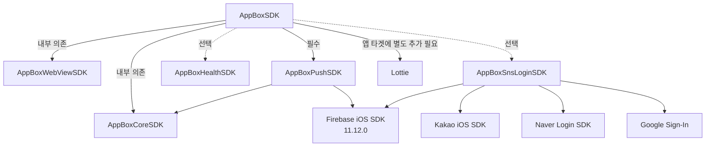

# AppBox SDK (iOS)

[](https://swift.org/package-manager/)
[](https://github.com/MobilePartnersCo/AppBoxSampleiOS)

- AppBox SDK는 모바일 웹사이트를 앱으로 패키징하여 최소한의 개발로 App Store에 등록할 수 있는 솔루션입니다.
- 모바일 웹사이트에서 JavaScript 코드를 사용해 앱의 기능을 사용할 수 있으며, 약 40+ 기능을 무료로 제공합니다.
- SDK 형태로 제공되며, 도메인(또는 Base URL)만 입력하면 기본 브라우저 기능부터 간편히 사용 가능합니다.

---

## AppBox SDK 사용 샘플소스

- iOS 샘플 앱: https://github.com/MobilePartnersCo/AppBoxSampleiOS

---

## 라이선스

- AppBox SDK의 사용은 영구적으로 무료입니다. 기업 또는 개인 상업적인 목적으로 사용 할 수 있습니다.

---

## 개발자 메뉴얼

- 메뉴얼: https://console.appboxapp.com/guide/appbox/%EC%B4%88%EA%B8%B0%20%EC%84%A4%EC%A0%95

---

## 데모앱 다운로드

- GooglePlay: https://play.google.com/store/apps/details?id=kr.co.mobpa.appbox
- AppStore: https://apps.apple.com/kr/app/id6737824370

---

## 최신 업데이트 (v1.2.11, 2026.05.15)

- AppsFlyer Deep Link payload를 AppBox 웹 SDK ready 이후에만 JavaScript로 전달하도록 보강했습니다.
- WebView navigation 시작 시 deep link JS bridge ready 상태를 초기화해 이전 페이지 상태가 새 페이지 전달에 섞이지 않도록 했습니다.
- `inapp.ready` 수신 경로를 기준으로 pending delivery를 flush하도록 정리했습니다.
- `window.AppboxSDK.isReady === true` 확인 후 `window.AppboxSDK.deepLink.onReceive(payload)`를 호출합니다.
- Breaking change, public API 변경, 외부 의존성 변경은 없습니다.

<details>
<summary>이전 업데이트 내역</summary>

### v1.2.10 (2026.05.15)

- `AppBox.shared.handleURL(_:options:)` API를 추가해 URL callback의 source application/options 정보를 SDK 라우팅에 전달합니다.
- SNS 로그인 URL은 `AppBoxSnsLoginSDK`로 우선 라우팅하고, AppsFlyer는 `scheme://open` 형태의 URI Scheme 딥링크만 처리하도록 제한했습니다.
- SceneDelegate 예제도 URLContext options를 AppDelegate openURL options 형태로 변환해 전달하도록 업데이트했습니다.
- v1.2.9 변경 포함: AppsFlyer Deep Link JS bridge, landscape 대응, 스캐너 portrait 고정, PDF/Image viewer 회전 레이아웃 개선.

### v1.2.9 (2026.05.15)

- AppsFlyer UDL result를 `window.AppboxSDK.deepLink.onReceive(payload)`로 전달하는 JS bridge 추가
- WebView 준비 전 수신된 딥링크 pending queue 보관 및 준비 후 flush 처리
- 동일 딥링크 중복 delivery 방지
- JS payload 계약 정리: `deep_link_value`, `subParam`, rawParams 제외
- iPhone/iPad portrait + landscape 허용 정책 및 주요 SDK 화면 회전 레이아웃 대응
- QR/Barcode 스캐너는 브릿지로 띄운 카메라 화면만 portrait 고정
- 구형 인앱 오픈 액션 제거 및 Health bridge 시그니처 정리
- WhiteLabel config의 top-level `"landscape": "Y" | "N"` 정책 반영

### v1.2.8 (2026.05.12)

- `gmenu.openHamburgerMenu`로 열린 햄버거 메뉴의 메뉴/프로필 action 실행 문제 수정
- 햄버거 메뉴 닫기 시 child view controller와 view hierarchy 정리 보강
- v1.2.7 변경 포함: AppsFlyer UDL public API, 고객사 자체 `WKWebView` attach, `appbox.getAppId`, Push-only/sendMessage 호환 API

### v1.2.7 (2026.05.11)

- AppsFlyer Unified Deep Linking 연동용 AppBox public API 추가
- 고객사 자체 `WKWebView`에 AppBox bridge shim을 attach하는 경로 보강
- AppBox 웹 SDK auto-bootstrap용 `appbox.getAppId` 브릿지 추가
- WebManager delegate 준비 전 수신된 브릿지 메시지 큐 처리 안정화
- AppBoxPushSDK에 Push-only/sendMessage 호환 public API 추가

### v1.2.6 (2026.04.29)

- AppBoxPushSDK 푸시 구독 상태 관리 방식 개선
- 기존 설치 사용자가 SDK 업데이트 후 푸시 구독 상태를 안정적으로 동기화하도록 개선
- 앱 실행 및 토큰 등록 흐름에서 푸시 구독 처리 재시도 안정성 강화
- 외부 공개 API, 최소 iOS 버전, Firebase iOS SDK 의존성 변경 없음

### v1.2.4 (2026.04.29)

- AppBoxCoreSDK / AppBoxWebViewSDK 기반 모듈화 구조 강화
- 인앱 메시지 표시 구조를 네이티브 UI에서 웹 SDK 브릿지 기반으로 전환
- `touchOpenType=INAPP` 푸시 클릭, 앱 활성화, 웹뷰 ready 상태를 고려한 인앱 메시지 표시 흐름 개선
- 인앱 노출/이벤트 큐 CoreData 저장 및 재전송 흐름 추가
- 푸시 알림 이미지 처리 및 푸시 설정 디코딩 안정화
- 개발/운영 환경 기준 웹뷰 Safari 검사 가능성 제어 및 `console.appboxapp.com` 도메인 반영

### v1.2.3 (2026.04.17)

- 푸시 클릭 기반 인앱 메시지 표시 흐름 강화
- 인앱 메시지 큐 재구성 및 대기 메시지 삽입 로직 개선
- 브릿지 메시지 병렬 처리 정책 개선

### v1.2.0 (2026.03.05)

- FCM 구독 처리 기능 추가
- 웹브릿지 중복 호출 방지 (`BridgeGuard`) 추가

### v1.0.55 (2026.02.26)

- 브릿지 액션 추가: `application.getOSVersion`, `phone.getContacts`
- iOS 26 리퀴드글라스 대응 (하단 탭/플로팅 메뉴 안정화)

### v1.0.54 (2026.02.12)

- 웹뷰 Preload API 추가: `AppBox.shared.preloadWebView()`

### v1.0.44 (2025.12.12)

- `AppBoxSnsLoginSDK` 지원 추가 (네이버/카카오/구글/애플 로그인)
- 브릿지 액션 추가: `application.snsLogin`, `application.snsLogout`

</details>

---

## SDK 구성(모듈)

| 모듈 | 선택 기준 | 설명 |
|---|---|---|
| `AppBoxSDK` | AppBox 기본 WebView 또는 고객사 자체 `WKWebView` bridge 사용 시 | 핵심(WebView/브릿지/공통 UI/스토리지/시스템 기능/웹 기반 인앱 메시지 연동) |
| `AppBoxPushSDK` | 푸시/FCM 사용 시, 또는 AppBox 기본 WebView 조합 | 푸시/FCM 연동, Push-only/sendMessage 호환 native API 제공 |
| `AppBoxHealthSDK` | HealthKit 기능 사용 시 | HealthKit(걸음 수 등) |
| `AppBoxSnsLoginSDK` | SNS 로그인 사용 시 | 네이버/카카오/구글/애플 로그인 |
| `AppBoxCoreSDK` | 직접 선택하지 않음 | AppBoxSDK/AppBoxPushSDK의 설정, 네트워크, CoreData, 암호화 공통 기능을 위한 내부 의존성 |
| `AppBoxWebViewSDK` | 직접 선택하지 않음 | AppBoxSDK의 웹뷰 런타임/브릿지 실행을 위한 내부 의존성 |

### 필수 외부 의존성

`Lottie`는 AppBoxSDK 패키지에 포함되어 있지 않으므로, SDK를 사용하는 앱 타겟에 별도로 추가해야 합니다.

| 의존성 | 필수 여부 | 설명 |
|---|---:|---|
| `Lottie` | ✅ | 로딩 인디케이터의 Lottie JSON / dotLottie(`.lottie`) 애니메이션 표시 지원 |

<details>
<summary>의존성 다이어그램(mermaid)</summary>


```mermaid
graph TB
    AppBoxSDK[AppBoxSDK]
    AppBoxCoreSDK[AppBoxCoreSDK]
    AppBoxWebViewSDK[AppBoxWebViewSDK]
    AppBoxPushSDK[AppBoxPushSDK]
    AppBoxHealthSDK[AppBoxHealthSDK]
    AppBoxSnsLoginSDK[AppBoxSnsLoginSDK]

    Firebase[Firebase iOS SDK<br/>11.12.0]
    KakaoSDK[Kakao iOS SDK]
    NaverSDK[Naver Login SDK]
    GoogleSignIn[Google Sign-In]
    Lottie[Lottie]

    AppBoxSDK -->|내부 의존| AppBoxCoreSDK
    AppBoxSDK -->|내부 의존| AppBoxWebViewSDK
    AppBoxSDK -->|필수| AppBoxPushSDK
    AppBoxSDK -->|앱 타겟에 별도 추가 필요| Lottie
    AppBoxSDK -.->|선택| AppBoxHealthSDK
    AppBoxSDK -.->|선택| AppBoxSnsLoginSDK

    AppBoxPushSDK --> AppBoxCoreSDK
    AppBoxPushSDK --> Firebase
    AppBoxSnsLoginSDK --> Firebase
    AppBoxSnsLoginSDK --> KakaoSDK
    AppBoxSnsLoginSDK --> NaverSDK
    AppBoxSnsLoginSDK --> GoogleSignIn
```

</details>

---

## 통합 방식 선택

먼저 앱에서 누가 `WKWebView`를 소유하는지와 푸시만 필요한지 기준으로 통합 방식을 고릅니다. Push-only 방식과 AppBox 기본 WebView 방식은 초기화 진입점이 다르므로 한 앱에서 둘을 동시에 초기화하지 않습니다.

| 사용 상황 | 앱 타겟에 추가할 Product | 초기화 진입점 | 설명 |
|---|---|---|---|
| 푸시만 사용 | `AppBoxPushSDK` | `AppBoxPush.shared.initSDK(projectId:...)` | AppBox 웹뷰를 띄우지 않고 푸시, 토큰, 세그먼트, 전환, topic native API만 사용 |
| AppBox 기본 WebView 사용 | `AppBoxSDK`, `AppBoxPushSDK` | `AppBox.shared.initSDK(...)` + `AppBox.shared.start(from:)` | AppBox가 `WKWebView`, navigation, bridge 전체를 관리 |
| 고객사 자체 WKWebView 사용 | `AppBoxSDK` + 필요 시 `AppBoxPushSDK` | `AppBox.shared.attach(webView)` | 고객사가 만든 `WKWebView`는 유지하고 AppBox 인앱/웹 SDK bridge만 연결 |
| HealthKit 추가 | 위 조합 + `AppBoxHealthSDK` | 별도 초기화 없음 | `application.getHealthStepCount` bridge 사용 시 추가 |
| SNS 로그인 추가 | 위 조합 + `AppBoxSnsLoginSDK` | `AppBoxSnsLogin.shared.initialize...` | `application.snsLogin`, `application.snsLogout` 사용 시 추가 |

`AppBoxCoreSDK`, `AppBoxWebViewSDK`는 내부 의존성입니다. 고객사 앱 코드에서 직접 import하거나 Product 선택 기준으로 안내하지 않습니다.

---

## 전체 기능 (요약)

- 브라우저의 기본기능
- 생체 인증, 탭 메뉴/브라우저 메뉴/햄버거 메뉴, 진동, 로딩 아이콘, 토스트 메시지, 인트로
- 플로팅 메뉴, 로컬 푸시, 앱 평가, 달력, 팝업(전체/중앙/바텀시트), 이미지 뷰어, 외부 페이지 열기
- 바코드/QR 스캐너, QR/바코드 팝업, 업데이트 실행, 다른 앱 실행
- 공유하기, 앱 종료, 위치 조회, 전화걸기, 문자보내기, 걸음수(HealthKit), 푸시 토큰, 세그먼트 전송 등
- 웹 SDK 브릿지 기반 인앱 메시지 표시, 노출/클릭 이벤트 큐, INAPP 푸시 클릭 연동
- OS 버전 조회(`application.getOSVersion`), 연락처 선택(`phone.getContacts`)
- SNS 로그인(선택): 네이버/카카오/구글/애플 (`application.snsLogin`, `application.snsLogout`)
- AppsFlyer URI Scheme Deep Link 수신 및 웹 JS handler 전달
- 호스트 앱 orientation 정책을 따르는 portrait/landscape 레이아웃 대응(스캐너 카메라 VC는 portrait 고정)

---

## 브라우저의 기본기능

- 동영상 플레이어의 전체화면 지원
- KG이니시스, 토스페이먼트, 나이스페이먼츠 등의 PG결제 지원
- 파일 업/다운로드: WebView 내에서 파일 업로드 및 다운로드 지원
- `window.open()`으로 새창 열기 지원

---

## 설치 방법 (SPM)

AppBoxSDK는 Swift Package Manager를 통해 배포됩니다.  
`AppBoxPushSDK`는 Firebase(`firebase-ios-sdk`) `11.12.0`에 종속됩니다.

1. Xcode에서 `Project Target` → `Package Dependencies` → `+` 를 눌러 패키지 추가 화면을 엽니다.
   

2. 다음 SPM URL을 추가합니다.
   ```console
   https://github.com/MobilePartnersCo/AppBoxSDKFramwork
   ```

3. Dependency Rule을 설정하고 Add Package를 눌러 추가합니다.
   

4. 사용 유형에 맞는 Product를 타겟에 추가합니다.
   

   | 사용 유형 | 앱 타겟 Product |
   |---|---|
   | 푸시만 사용 | `AppBoxPushSDK` |
   | AppBox 기본 WebView 사용 | `AppBoxSDK`, `AppBoxPushSDK` |
   | 고객사 자체 WKWebView 사용 | `AppBoxSDK` + 필요 시 `AppBoxPushSDK` |
   | HealthKit 사용 | `AppBoxHealthSDK` 추가 |
   | SNS 로그인 사용 | `AppBoxSnsLoginSDK` 추가 |
   | 푸시 이미지 Service Extension | Extension 타겟에 `AppBoxPushSDK` 추가 |

   `AppBoxCoreSDK`, `AppBoxWebViewSDK`는 내부 의존성으로 함께 resolve되며 고객사 앱 타겟에서 직접 선택하거나 import하지 않습니다.

5. Lottie 패키지를 추가하고 앱 타겟에 `Lottie` product를 연결합니다.

   ```console
   https://github.com/airbnb/lottie-spm.git
   ```

6. 설정 완료
   
   

---

## 설정

### Info.plist (AppBoxSDK)

```xml
<key>NSFaceIDUsageDescription</key>
<string>생체인증을 사용하기 위해 필요합니다.</string>
<key>NSCameraUsageDescription</key>
<string>카메라를 사용하기 위해 필요합니다.</string>
<key>NSLocationWhenInUseUsageDescription</key>
<string>위치정보 제공을 위해 필요합니다.</string>
<key>NSAppTransportSecurity</key>
<dict>
    <key>NSAllowsArbitraryLoads</key>
    <true/>
</dict>
<key>UIBackgroundModes</key>
<array>
    <string>remote-notification</string>
</array>
```

다른 앱 열기 기능을 사용하려면 다음도 추가합니다.

```xml
<key>LSApplicationQueriesSchemes</key>
<array>
   <string>{호출할 앱 스키마}</string>
</array>
```

### Info.plist (AppBoxHealthSDK)

```xml
<key>NSHealthShareUsageDescription</key>
<string>걸음수를 가져오기 위해 필요합니다.</string>
<key>NSHealthUpdateUsageDescription</key>
<string>걸음수를 가져오기 위해 필요합니다.</string>
```

### Info.plist (AppBoxSnsLoginSDK, 선택)

```xml
<key>CFBundleURLTypes</key>
<array>
  <!-- Google -->
  <dict>
    <key>CFBundleURLSchemes</key>
    <array>
      <string>com.googleusercontent.apps.YOUR_CLIENT_ID</string>
    </array>
  </dict>
  <!-- Naver -->
  <dict>
    <key>CFBundleURLSchemes</key>
    <array>
      <string>YOUR_NAVER_URL_SCHEME</string>
    </array>
  </dict>
  <!-- Kakao -->
  <dict>
    <key>CFBundleURLSchemes</key>
    <array>
      <string>kakaoYOUR_KAKAO_APP_KEY</string>
    </array>
  </dict>
</array>

<key>LSApplicationQueriesSchemes</key>
<array>
  <string>kakaokompassauth</string>
  <string>kakaotalk</string>
  <string>naversearchapp</string>
  <string>naversearchthirdlogin</string>
</array>
```

### Info.plist (AppsFlyer URI Scheme 딥링크, 선택)

AppsFlyer URI Scheme 딥링크를 사용하는 앱은 Xcode `URL Types`에 수신 scheme을 등록합니다. `devKey`, `appleAppID`는 Info.plist 필수 키가 아니며 `AppBox.shared.configureAppsFlyer(devKey:appleAppID:)`에 문자열로 전달합니다.

```xml
<key>CFBundleURLTypes</key>
<array>
  <dict>
    <key>CFBundleURLName</key>
    <string>AppsFlyer Deep Link</string>
    <key>CFBundleURLSchemes</key>
    <array>
      <string>YOUR_URI_SCHEME</string>
    </array>
  </dict>
</array>
```

AppsFlyer OneLink/URI Scheme 설정의 deep link URL은 `{scheme}://open` 형태를 사용합니다. Universal Link forwarding은 v1.2.11 README 범위에 포함하지 않습니다.

---

## Signing & Capabilities

### HealthKit (AppBoxHealthSDK)

걸음수를 사용하려면 `Signing & Capabilities`에 HealthKit을 추가해야합니다.

1. `Targets` → `Signing & Capabilities` → `+ Capability`
   
2. `HealthKit` 검색 후 적용
   
3. 설정 완료
   

### Push Notifications (AppBoxPushSDK)

푸시를 사용하려면 `Signing & Capabilities`에 Push Notifications을 추가해야합니다.

1. `Targets` → `Signing & Capabilities` → `+ Capability`
   
2. `Push Notifications` 검색 후 적용
   
3. 설정 완료
   

### Service Extension (푸시 이미지 사용 시, AppBoxPushSDK)

푸시에 이미지를 사용하려면 Notification Service Extension을 추가하고 `App Groups`를 설정합니다.

1. Extension 추가(예시)
   
2. `Notification Service Extension` 선택
   
3. 이름 입력 후 생성
   
4. `Don't Activate`
   
5. Extension의 Minimum Deployment를 메인 앱과 동일하게 설정
   
6. 메인 앱에 `App Groups` 추가
   
   
7. App Group 생성 및 활성화
   
   
   
8. Extension 타겟에도 동일 App Group 활성화
   
9. Extension 타겟에 `AppBoxPushSDK` 추가
   
   
   

`NotificationService.swift` 적용 예시:

```swift
import UserNotifications
import AppBoxPushSDK

class NotificationService: UNNotificationServiceExtension {

  override func didReceive(_ request: UNNotificationRequest,
                           withContentHandler contentHandler: @escaping (UNNotificationContent) -> Void) {
    AppBoxPush.shared.createFCMImage(request, withContentHandler: contentHandler)
  }
}
```

---

## 사용법

### 1) AppBox 기본 WebView 사용

AppBox가 웹뷰를 생성하고 bridge 전체를 관리하는 방식입니다. 웹사이트를 앱처럼 패키징하는 일반 AppBoxSDK 사용자는 이 방식을 사용합니다.

```swift
import UIKit
import WebKit
import UserNotifications
import AppBoxSDK
import AppBoxPushSDK
import AppBoxSnsLoginSDK

@main
final class AppDelegate: UIResponder, UIApplicationDelegate, UNUserNotificationCenterDelegate {
  func application(_ application: UIApplication,
                   didFinishLaunchingWithOptions launchOptions: [UIApplication.LaunchOptionsKey: Any]?) -> Bool {
    UNUserNotificationCenter.current().delegate = self

    // Google 로그인 등 Firebase Client ID가 필요한 기능은 AppBox 초기화 전에 설정합니다.
    AppBoxPush.shared.initializeFirebaseClientID(
      clientID: "YOUR_FIREBASE_CLIENTID"
    )

    let appBoxWebConfig = AppBoxWebConfig()
    let wkWebViewConfig = WKWebViewConfiguration()
    if #available(iOS 14.0, *) {
      wkWebViewConfig.defaultWebpagePreferences.allowsContentJavaScript = true
    } else {
      wkWebViewConfig.preferences.javaScriptEnabled = true
    }
    appBoxWebConfig.wKWebViewConfiguration = wkWebViewConfig

    AppBox.shared.initSDK(
      baseUrl: "https://www.example.com",
      projectId: "YOUR_PROJECT_ID",
      webConfig: appBoxWebConfig,
      debugMode: true
    )

    AppBox.shared.preloadWebView()
    AppBox.shared.setPullDownRefresh(used: true)

    AppBoxSnsLogin.shared.initializeKakao(appKey: "YOUR_KAKAO_APPKEY")
    AppBoxSnsLogin.shared.initializeNaver(
      appName: "YOUR_NID_APPNAME",
      clientId: "YOUR_NID_CLIENTID",
      clientSecret: "YOUR_NID_CLIENTSECRET",
      urlScheme: "YOUR_NID_URLSCHEME"
    )

    return true
  }

  func application(_ application: UIApplication,
                   didRegisterForRemoteNotificationsWithDeviceToken deviceToken: Data) {
    AppBoxPush.shared.appBoxPushApnsToken(apnsToken: deviceToken)
  }

  func application(_ app: UIApplication,
                   open url: URL,
                   options: [UIApplication.OpenURLOptionsKey : Any] = [:]) -> Bool {
    if AppBox.shared.handleURL(url, options: options) { return true }
    return false
  }

  func application(_ application: UIApplication,
                   continue userActivity: NSUserActivity,
                   restorationHandler: @escaping ([UIUserActivityRestoring]?) -> Void) -> Bool {
    _ = AppBox.shared.handleUserActivity(userActivity)
    return false
  }

  func userNotificationCenter(_ center: UNUserNotificationCenter,
                              didReceive response: UNNotificationResponse,
                              withCompletionHandler completionHandler: @escaping () -> Void) {
    AppBox.shared.movePush(response: response)
    completionHandler()
  }

  func application(_ application: UIApplication,
                   didReceiveRemoteNotification userInfo: [AnyHashable : Any],
                   fetchCompletionHandler completionHandler: @escaping (UIBackgroundFetchResult) -> Void) {
    AppBox.shared.handledidReceiveRemoteNotification(userInfo: userInfo)
    completionHandler(.newData)
  }
}
```

웹뷰 실행:

```swift
AppBox.shared.start(from: self) { isSuccess, error in
  if isSuccess {
    print("AppBox:: SDK 실행 성공")
  } else {
    print(error?.localizedDescription ?? "error : unknown Error")
  }
}
```

### 2) 푸시만 사용

웹뷰가 필요 없고 푸시만 사용하는 앱은 `AppBoxSDK`를 초기화하지 않습니다. `baseUrl`도 필요 없습니다.

```swift
import UIKit
import UserNotifications
import AppBoxPushSDK

@main
final class AppDelegate: UIResponder, UIApplicationDelegate, UNUserNotificationCenterDelegate, AppBoxPushDelegate {
  func application(_ application: UIApplication,
                   didFinishLaunchingWithOptions launchOptions: [UIApplication.LaunchOptionsKey: Any]?) -> Bool {
    UNUserNotificationCenter.current().delegate = self
    AppBoxPush.shared.delegate = self

    AppBoxPush.shared.initSDK(
      projectId: "YOUR_PROJECT_ID",
      debugMode: false,
      autoRegisterForAPNS: true
    ) { result, error, pushPermissionGranted in
      if let error = error {
        print("AppBoxPush init failed: \(error.localizedDescription)")
        return
      }

      print(result?.message ?? "")
      print(pushPermissionGranted?.boolValue ?? false)
    }

    return true
  }

  func application(_ application: UIApplication,
                   didRegisterForRemoteNotificationsWithDeviceToken deviceToken: Data) {
    AppBoxPush.shared.application(
      didRegisterForRemoteNotificationsWithDeviceToken: deviceToken
    ) { result, error in
      print(error?.localizedDescription ?? result?.token ?? "")
    }
  }

  func userNotificationCenter(_ center: UNUserNotificationCenter,
                              didReceive response: UNNotificationResponse,
                              withCompletionHandler completionHandler: @escaping () -> Void) {
    AppBoxPush.shared.saveNotiClick(response)
    completionHandler()
  }

  func appBoxPushTokenDidUpdate(_ token: String?) {
    print("AppBox push token updated: \(token ?? "")")
  }
}
```

Push-only에서 사용할 수 있는 native API 예시:

```swift
AppBoxPush.shared.saveSegment(segment: ["grade": "vip"])
AppBoxPush.shared.trackingConversion(conversionCode: "purchase")
AppBoxPush.shared.subscribeToTopic("event_2026")
AppBoxPush.shared.unsubscribeFromTopic("event_2026")
let token = AppBoxPush.shared.getPushToken()
```

### 3) 고객사 자체 WKWebView 사용

이미 앱에서 직접 관리하는 `WKWebView`가 있다면 AppBox가 웹뷰를 새로 띄우지 않고 bridge만 연결합니다.

```swift
import UIKit
import WebKit
import AppBoxSDK

final class CustomerWebViewController: UIViewController, WKNavigationDelegate {
  private let webView = WKWebView()

  override func viewDidLoad() {
    super.viewDidLoad()

    AppBox.shared.attach(webView)
    AppBox.shared.setActiveWebView(webView)
    AppBox.shared.attachNavigationObservation(webView, forwardingTo: self)
  }

  override func viewDidDisappear(_ animated: Bool) {
    super.viewDidDisappear(animated)

    AppBox.shared.detach(webView)
    AppBox.shared.detachNavigationObservation(webView)
  }
}
```

고객사 자체 `WKWebView` attach 경로는 웹 인앱메시지 lifecycle 연결이 목적입니다. 허용 action은 `appbox.notification.ping`, `appbox.getAppId`, `inapp.*` 중심이며, 전체 AppBox bridge action을 외부 웹뷰에 모두 열지 않습니다.

### 4) AppsFlyer 딥링크 선택 연동

AppsFlyer URI Scheme 딥링크는 AppBoxSDK API로 설정합니다. 서비스 앱은 AppsFlyer SDK 타입을 직접 import하지 않습니다. `devKey`와 `appleAppID`는 문자열로 전달하며 JS function name은 받지 않습니다. Native는 항상 현재 AppBox WebView에 `window.AppboxSDK.deepLink.onReceive(payload)`를 호출합니다.

```swift
AppBox.shared.configureAppsFlyer(
  devKey: "YOUR_APPSFLYER_DEV_KEY",
  appleAppID: "YOUR_NUMERIC_APP_STORE_ID"
)
AppBox.shared.configureAppsFlyerJavaScriptBridge()
AppBox.shared.startAppsFlyer()
```

웹앱은 v3.js가 제공하는 handler 등록 방식으로 payload를 사용합니다. JS payload에는 `rawParams`가 포함되지 않으며, top-level 값은 `deep_link_value`, sub parameter 객체명은 `subParam`입니다.

```javascript
window.AppboxSDK.deepLink.setOnReceive(function(payload) {
  console.log('[AppBoxSDK][AppsFlyer]', payload.deep_link_value, payload.subParam);
});
```

AppsFlyer URI Scheme 딥링크 URL은 `{scheme}://open` 형태로 설정합니다. Scene 기반 앱은 URLContext options를 SDK에 전달하고, AppBox의 기존 UserActivity 처리 코드는 유지할 수 있습니다.

```swift
func scene(_ scene: UIScene, continue userActivity: NSUserActivity) {
  _ = AppBox.shared.handleUserActivity(userActivity)
}

func scene(_ scene: UIScene, openURLContexts URLContexts: Set<UIOpenURLContext>) {
  guard let context = URLContexts.first else { return }
  _ = AppBox.shared.handleURL(context.url, options: appOpenOptions(from: context))
}

private func appOpenOptions(from context: UIOpenURLContext) -> [UIApplication.OpenURLOptionsKey: Any] {
  var result: [UIApplication.OpenURLOptionsKey: Any] = [:]
  if let sourceApplication = context.options.sourceApplication {
    result[.sourceApplication] = sourceApplication
  }
  if let annotation = context.options.annotation {
    result[.annotation] = annotation
  }
  result[.openInPlace] = context.options.openInPlace
  return result
}
```

### 5) 추가 기능 설정

```swift
AppBox.shared.setDebug(debugMode: true)
AppBox.shared.setPullDownRefresh(used: true)
AppBox.shared.preloadWebView()
```

인트로 설정(선택):

```swift
if let introItem1 = AppBoxIntroItems(imageUrl: "https://example.com/image.jpg") {
  let intro = AppBoxIntro(
    indicatorDefColor: "#a7abab",
    indicatorSelColor: "#000000",
    fontColor: "#000000",
    item: [introItem1]
  )
  AppBox.shared.setIntro(intro)
}
```

---

## 웹 브릿지 지원 범위

브릿지 액션은 WebView 안의 웹 페이지에서 네이티브 기능을 호출할 때 사용하는 인터페이스입니다.
네이티브 앱에서 SDK만 연동하는 경우에는 상세 request/response 스키마를 직접 참조할 필요가 없습니다.

| 사용 방식 | 브릿지 사용 여부 | 설명 |
|---|---|---|
| 푸시만 사용 | 사용 안 함 | `AppBoxPushSDK`의 네이티브 API만 연동합니다. |
| AppBox 기본 WebView 사용 | 사용 | `AppBoxSDK`가 관리하는 WebView에서 AppBox 브릿지 액션을 사용할 수 있습니다. |
| 고객사 자체 WKWebView 사용 | 제한 사용 | `attach(webView:)` 이후 지원되는 브릿지 액션만 사용할 수 있습니다. |

주요 브릿지 액션 예시는 릴리즈 노트와 기능 요약에 포함되어 있습니다.
상세 request/response 스키마는 고객사 연동 범위에 따라 별도 제공됩니다.

---

## 요구 사항

- iOS 13.0 이상
- Swift 5.4 이상
- Xcode 15.0 이상 권장

---

## 주의 사항

1. AppBox 기본 WebView 방식은 `AppBox.shared.initSDK(...)` 이후에 `start`, `preload`, bridge 기반 기능을 호출합니다.
2. Push-only 방식은 `AppBox.shared.initSDK(...)`를 호출하지 않고 `AppBoxPush.shared.initSDK(projectId:...)`만 사용합니다.
3. 고객사 자체 `WKWebView` attach 방식은 지원 action 범위가 제한됩니다.

---

## 지원

- 이메일: contact@mobpa.co.kr
- 홈페이지: https://www.appboxapp.com
